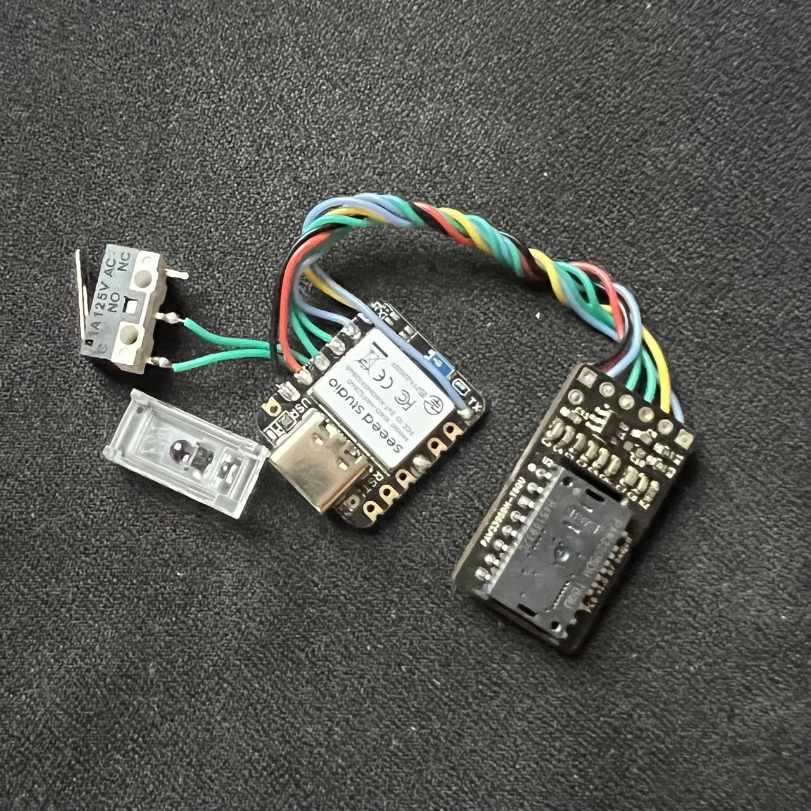
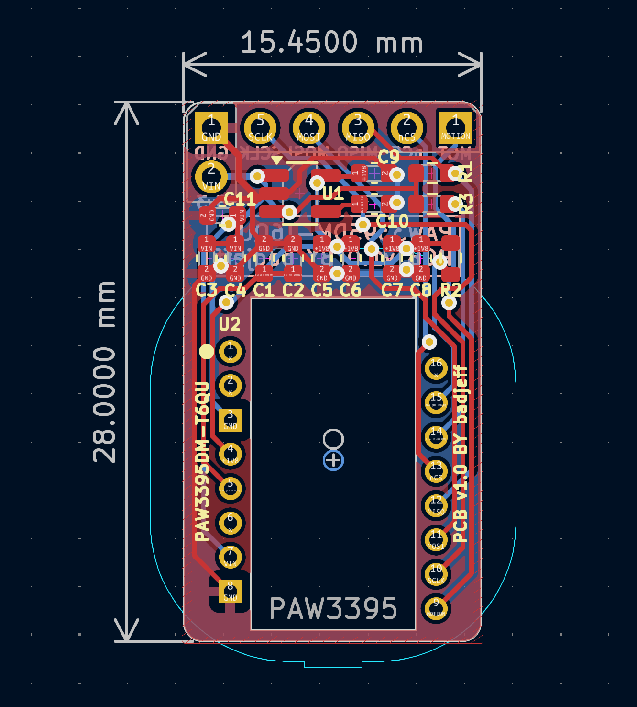
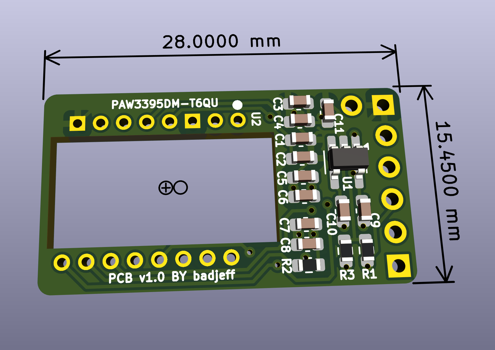

# PAW3395 PCB

[PixArt PAW3395DM-T6QU](https://www.pixart.com/products-detail/129/PAW3395DM-T6QU) low power laser mouse sensor breakout board.

- Be operated with 3.3V voltage level ONLY.
- Outlined as narrow as possible for side mount horizontally and perpendicular on low profile keyboards.

*Figure 1: Size comparing to Seeed XIAO BLE*

## PCB

Online preview avaliable [here](https://kicanvas.org/?github=https%3A%2F%2Fgithub.com%2Fbadjeff%2Fpaw3395-pcb), powered by [KiCanvas](https://github.com/theacodes/kicanvas).

*Figure 2: PCB edgecuts dimension*

*Figure 2: PCB 3D View - 1.6mm FR4*

### BOM

|Designator|Footprint|Quantity|Value|LCSC Part #|
|-|-|-|-|-|
|C1|SMD 0603|1|4.7uF||
|C11, C9|SMD 0603|2|1uF||
|C2, C4, C5|SMD 0603|3|100nF||
|C3, C6, C8|SMD 0603|3|10uF||
|C7|SMD 0603|1|22uF||
|C10|SMD 0603|1|DNI||
|R1|SMD 0603|1|10K|C25804|
|R2|SMD 0603|1|4.7|C23164|
|R3|SMD 0603|1|2M|C22976|
|U1|SOT-23-5|1|TLV74318PDBVR||
|U2|PAW3395DM-T6QU|1|PAW3395||
|J1,J2|2.54mm Pin header||1x2, 1x5||

- DNI: don't install.
- SMD 0603 (Imperial) aka 1608 Metric.
- PAW3395DM-T6QU needs to be used with *compact* LOAE-LSI1 lens, or *chonky* LM19-LSI lens.
- ~~`U1` LDO can be replace by RT9193-18GB, change `C10` to 22nF.~~
- `U1` LDO can be replace by XC6219B182MR.
- `C1` can be replace by 3.3uF.

### Board Characteristics

- Copper layer count: 2
- Board thickness: 1.6 mm
- Board overall dimensions: 15.5 x 28 mm

### Voltage level config

- 3.3V logic
- VIN: 3.3V

## License

Available under the [CERN-OHL-P v2](/LICENSE) permissive license.
